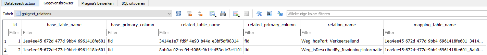

# Resultaat

## Referentie-implementatie

Aan de hand van de volgende voorbeelddata is een proefimplementatie van
IMBOR-areaalgegevens in Geopackage uitgevoerd.

Tabel Voorbeelddata IMBOR eigenschappen

|                 | **IMBOR - kolom**     | **IMBOR - waarde**                                                                 |
|-----------------|-----------------------|------------------------------------------------------------------------------------|
| Concept         | FysiekObjectURI       | https://data.crow.nl/imbor/def/1ea4ee45-672d-477d-9bb4-6961418fe601                |
|                 | FysiekObjectLabel     | Weg                                                                                |
| Attribuut(vorm) | EigenschapURI         | <https://data.crow.nl/imbor/def/2b1b2ffa-6cdd-4c54-b8c3-475757e347ff>              |
|                 | EigenschapLabel       | lengte                                                                             |
|                 | Datatype              | xsd:decimal                                                                        |
|                 | Eenheid               | M                                                                                  |
|                 | VastewaardeLijstURI   | <https://data.crow.nl/imbor/def/bf86855c-e30b-4005-bacf-7e5683b531dd>              |
|                 | VastewaardelijstLabel | WegType                                                                            |
|                 | VastewaardeURI        | <https://data.crow.nl/imbor/id/domeinwaarden/23736fbb-f07a-480a-91af-75dc0965b159> |
|                 | VastewaardeLabel      | Nationale stroomweg                                                                |

Tabel Voorbeeldata IMBOR relaties

|         | **IMBOR - kolom** | **IMBOR - waarde**                                                                                                                           |
|---------|-------------------|----------------------------------------------------------------------------------------------------------------------------------------------|
| Subject | SubjectURI        | [https://data.crow.nl/imbor/def/1ea4ee45-672d-477d-9bb4-6961418fe601\|](https://data.crow.nl/imbor/def/1ea4ee45-672d-477d-9bb4-6961418fe601) |
|         | SubjectLabel      | Weg                                                                                                                                          |
| Relatie | heeftRelatieURI   | [https://w3id.org/nen2660/def\#hasPart](https://w3id.org/nen2660/def#hasPart)                                                                |
|         | heeftRelatieLabel | hasPart                                                                                                                                      |
| Object  | ObjectURI         | https://data.crow.nl/imbor/def/3414e1e7-fd9f-4e93-b44a-e3bf5df08314                                                                          |
|         | ObjectLabel       | Verkeerseiland                                                                                                                               |
|         |                   |                                                                                                                                              |
| Relatie | heeftRelatieURI   | [https://w3id.org/nen2660/def\#isDescribedBy](https://w3id.org/nen2660/def#isDescribedBy)                                                    |
|         | heeftRelatieLabel | [isDescribedBy](https://w3id.org/nen2660/def#isDescribedBy)                                                                                  |
| Object  | ObjectURI         | <https://data.crow.nl/imbor/def/8ab0ac02-ee94-4086-9b14-d53ede3c4101>                                                                        |
|         | ObjectLabel       | Inwinningsinformatie                                                                                                                         |

Het voorbeeld Geopackage is beschikbaar via deze link:
<https://geonovum.github.io/gpkg/apps/areaalgegevens/voorbeeld-geopackage-areaalgegevens-IMBOR-NEN2660.gpkg>

Hierna volgt een beschrijving van de verschillende IMBOR-onderdelen en hoe deze
in de voorbeeld Geopackage zijn opgenomen.

### Sub/object

Structuur van sub/object wordt gedefinieerd in eigen feature tables. In deze
tabellen worden de instanties in records vastgelegd.

**gpkg_contents**

Definitie van sub/objecten wordt opgenomen in tabel **gpkg_contents:**

-   machineleesbare identifier als onderdeel van de URI van het sub/object wordt
    opgenomen in de kolom ‘**table_name**\`

-   mensleesbare alias wordt opgenomen in kolom ‘**identifier**’

-   definitie van het object in de kolom **‘description’**

### Attributen

Attributen, zijnde de kenmerken/eigenschappen van de sub/objecten worden
gedefinieerd in de tabel **gpkg_data_columns**:

-   machineleesbare identifier wordt opgenomen in kolom ‘**column_name**’.

-   mensleesbare naam van de eigenschap wordt opgenomen in kolom **‘name**’.

-   definitie van het attribuut c.q. de eigenschap het in de kolom
    **‘description’**

### Enumeraties

Enumeraties (constraints op toegestane attribuutwaarden) worden gedefinieerd in
de tabel **gpkg_data_column_constraints**:

-   machineleesbare identifier van de enumeratie of codelijst zijnde een
    contraint wordt opgenomen in kolom **‘constraint_name’**. Deze waarde van de
    constraint_name wordt toegevoegd aan kolom ‘constraint_name’ bij de kolom in
    de tabel gpkg_data_columns (zie figuur hierboven).

-   machineleesbare identifier van de enumeratiewaarde opgenomen in kolom
    **‘value’**

-   mensleesbare naam van de waardenlijst of attribuutwaarde wordt opgenomen in
    kolom **‘description’**.

### Relaties

>   Het concept voor relaties staat hieronder beschreven, maar de exacte werking
>   in software moet verder getest worden.

Voor relaties tussen sub/objecten wordt de extensie Related Tables op GeoPackage
toegepast.

De specificaties van de Related Tables extensie zijn vastgelegd in
<http://www.opengis.net/doc/IS/gpkg-rte/1.0>

*Definiëren van de extensie*

Related Tables Extension wordt gedefinieerd in tabel **gpkg_extensions**; voor
elke relatie wordt een aparte *mapping table* aangemaakt, en elke relatie als
record toegevoegd aan de tabel gpkg_extensions.

In elke mapping table worden de instanties van de relaties in records
vastgelegd.

*Definiëren van de relaties*

De relaties worden gedefinieerd in de tabel **gpkg_ext_relations**. Voor elke
relatie wordt opgenomen:

-   de naam van de tabel (*table_name*) van de brontabel in kolom
    **‘base_table’**

-   de naam van de tabel (*table_name*) van de doeltabel in de kolom
    **‘related_table’**

-   type van de relatie in de kolom **‘relation_name’.** Dit is waarde
    ‘features’ bij verwijziging van een tussen twee features tables en
    ‘simple_attributes’ bij verwijzing naar een attributentabel, zie
    [https://www.geopackage.org/guidance/extensions/related_tables.html\#using-profiles](https://www.geopackage.org/guidance/extensions/related_tables.html#using-profiles).

-   naam van de *mapping table* in de kolom **‘mapping_table’**, waarin de
    instanties van de relatie worden vastgelegd.

### Resultaat in QGIS

Het template geopackage is getest in QGIS.

Bij het openen worden de tabellen als lagen met of zonder geometrie herkend:

Van boven naar onder:

1.  Objecten Weg met vlakgeometrie.

2.  Objecten Verkeerseiland met vlakgeometrie

3.  Gegevens over Inwinninginformatie zonder geometrie

4.  Relatietabel tussen Weg en Verkeerseiland

5.  Relatietabel tussen Weg en Inwinninginformatie

## Change requests

Uit deze aanpak volgen twee verbetersuggesties c.q. wijzigingsverzoeken voor de
Geopackage standaard:

1\. Uitbreiding van de standaard met de mogelijkheid om eenheid als metadata bij
de kolommen op te nemen:

\- Deze aanpassing zou het mogelijk maken om informatie over de eenheden die
worden gebruikt in specifieke attribuutkolommen binnen een GeoPackage op te
nemen. Het toevoegen van eenheid als metadata zou bijvoorbeeld van cruciaal
belang zijn bij attributen die meetwaarden vertegenwoordigen, zoals lengte,
oppervlakte, volume, of andere metrische gegevens. Door eenheid als metadata toe
te voegen, kunnen gebruikers nauwkeuriger begrijpen en interpreteren welke
meeteenheden worden gebruikt in de attributen van de dataset.

2\. Uitbreiding van de standaard met de mogelijkheid om een URI van een relatie
op te nemen:

\- Deze voorgestelde uitbreiding zou de mogelijkheid toevoegen om een URI van een
gerelateerde dataset op te nemen binnen de structuur van het GeoPackage.
Hierdoor kunnen gebruikers eenvoudig verwijzingen leggen naar externe bronnen of
gerelateerde datasets die relevant zijn voor de gegevens die zijn opgeslagen in
het GeoPackage. Door deze functionaliteit toe te voegen, wordt de
interoperabiliteit tussen verschillende geografische datasets bevorderd, omdat
het gemakkelijker wordt om verbanden te leggen tussen verschillende
gegevensbronnen en externe informatiebronnen. Dit kan bijvoorbeeld nuttig zijn
bij het koppelen van een GeoPackage met aanvullende gegevensbronnen.

3\. Opnemen naam van de waardenlijst, nu kan alleen een identifier.
